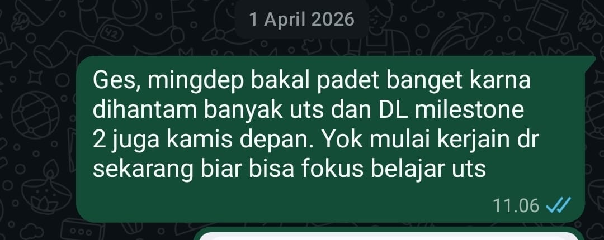
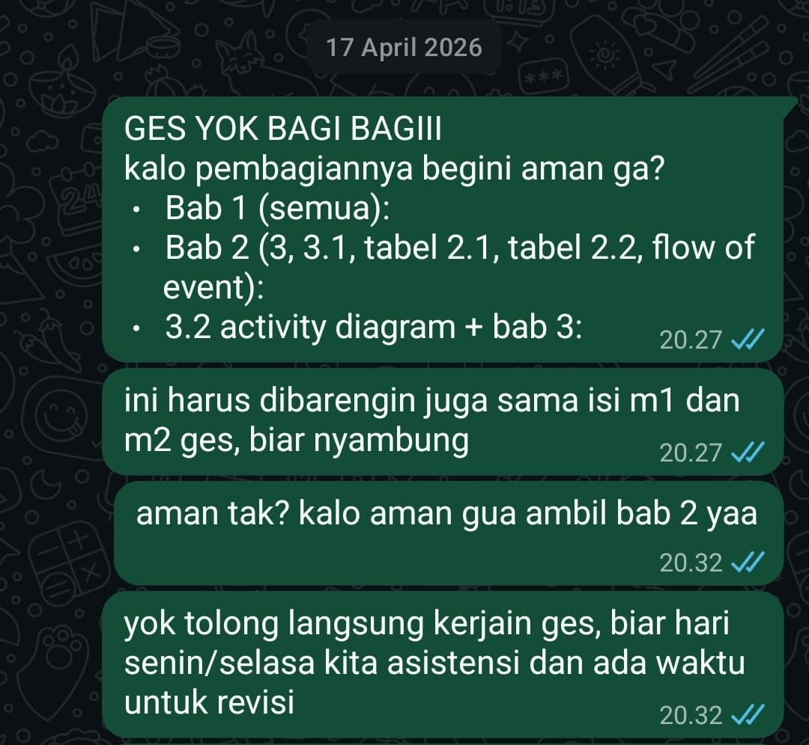
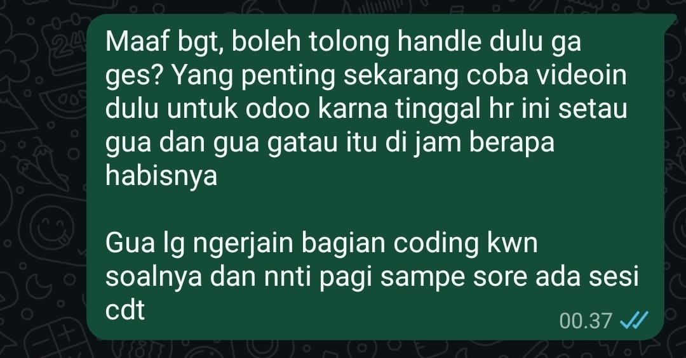
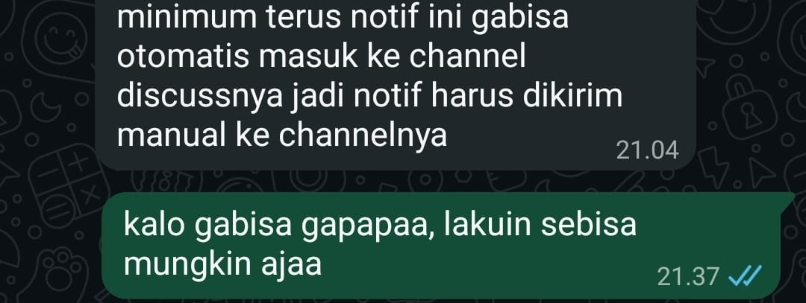

# Lembar Kerja Bab 02
## Tiga Narasi atas Satu Peristiwa

**Nama Mahasiswa:** Grasella  
**Tanggal Pengerjaan:** 22 September 2026

---

## Tujuan Pembelajaran

Latihan ini digunakan untuk melatih kejernihan batin (*intrapersonal communication*) dengan memisahkan fakta objektif dari interpretasi, mengenali emosi, melihat suatu peristiwa melalui tiga narasi, dan memilih respons yang disengaja.

Alur yang digunakan:

**Peristiwa (Fakta) → Interpretasi (Asumsi) → Narasi → Emosi → Pilihan → Tindakan**

---

# Bagian 1 — Identifikasi Kasus

## 1. Peristiwa yang Dapat Diamati (Fakta Objektif)

Peristiwa yang saya gunakan berasal dari pengalaman mengerjakan tugas besar secara berkelompok. Pada saat itu, kelompok sedang menghadapi beberapa tuntutan akademik secara bersamaan, termasuk UTS dan deadline Milestone 2.

Dalam percakapan kelompok, saya mengingatkan anggota kelompok agar mulai mengerjakan lebih awal karena jadwal akan semakin padat. Beberapa waktu kemudian, kelompok membahas pembagian pekerjaan. Saya menanyakan apakah pembagian tersebut sudah aman, kemudian menyatakan bahwa saya mengambil bagian Bab 2.

Saya juga mengingatkan anggota kelompok agar segera mengerjakan supaya masih tersedia waktu untuk asistensi dan revisi.

Dalam proses pengerjaan berikutnya, terdapat pekerjaan teknis yang perlu diselesaikan. Saya menawarkan diri untuk mengerjakan bagian coding KWN dan meminta anggota lain untuk menangani bagian video Odoo.

### Fakta yang dapat diamati

1. Kelompok memiliki tugas besar dengan deadline Milestone 2.
2. Pada periode tersebut terdapat tuntutan akademik lain, termasuk UTS.
3. Saya mengingatkan kelompok untuk mulai mengerjakan lebih awal.
4. Saya ikut membahas pembagian pekerjaan dalam kelompok.
5. Saya mengambil bagian Bab 2.
6. Saya mengingatkan kelompok agar masih memiliki waktu untuk asistensi dan revisi.
7. Dalam pekerjaan teknis, saya menawarkan diri mengerjakan bagian coding KWN.
8. Saya meminta anggota lain menangani bagian video Odoo.

Fakta-fakta tersebut menunjukkan adanya kebutuhan untuk melakukan koordinasi dan pembagian pekerjaan. Namun, fakta tersebut **tidak membuktikan bahwa anggota lain malas, tidak bertanggung jawab, atau tidak akan mengerjakan bagiannya**.

---

## 2. Interpretasi Pertama (Asumsi Otomatis)

Ketika melihat deadline semakin dekat dan banyak pekerjaan yang harus diselesaikan, pemikiran pertama saya adalah bahwa saya harus memastikan pekerjaan kelompok tetap berjalan.

Saya berpikir bahwa jika saya tidak ikut mengingatkan, membantu, atau mengambil bagian pekerjaan tertentu, ada kemungkinan tugas kelompok tidak selesai tepat waktu dan kelompok tidak memiliki cukup waktu untuk asistensi maupun revisi.

Saya juga cenderung menganggap bahwa mengambil lebih banyak tanggung jawab merupakan cara paling aman untuk mengurangi risiko tugas terlambat.

Setelah saya memisahkan fakta dari asumsi, saya menyadari bahwa pemikiran tersebut belum tentu benar. Saya tidak mengetahui secara pasti apa yang akan dilakukan anggota lain jika saya tidak mengambil tindakan tersebut.

Dengan demikian:

- **Fakta:** deadline semakin dekat dan pekerjaan perlu dikoordinasikan.
- **Interpretasi:** saya merasa harus mengambil lebih banyak tanggung jawab agar tugas pasti selesai.

---

## 3. Emosi & Sensasi Tubuh

### Emosi yang Dirasakan

| Emosi | Intensitas |
|---|---:|
| Cemas | 7/10 |
| Khawatir | 6/10 |
| Tertekan | 6/10 |
| Kesal | 5/10 |

### Sensasi Tubuh yang Muncul

Ketika memikirkan deadline dan banyaknya pekerjaan yang harus diselesaikan, saya merasa tubuh lebih tegang dan sulit merasa benar-benar tenang sebelum pekerjaan kelompok terlihat berjalan.

Saya juga merasakan dorongan untuk segera melakukan sesuatu agar situasi terasa lebih terkendali, misalnya mengingatkan anggota kelompok, mengambil bagian tugas, atau menawarkan bantuan pada pekerjaan yang belum selesai.

---

# Bagian 2 — Membedah Tiga Narasi

## Versi A — Narasi Korban (*Victim Narrative*)

### Isi Narasi Korban

Jika saya melihat situasi tersebut melalui narasi korban, saya dapat merasa bahwa keberhasilan tugas kelompok terlalu bergantung pada pekerjaan anggota lain.

Saya dapat berpikir bahwa saya sudah berusaha menjalankan tanggung jawab saya, tetapi saya tetap tidak dapat memastikan tugas selesai karena saya bergantung pada tindakan orang lain.

Dari sudut pandang ini, saya merasa tidak mempunyai banyak pilihan selain terus mengingatkan anggota kelompok atau mengambil lebih banyak pekerjaan sendiri.

Saya juga dapat merasa bahwa jika saya tidak turun tangan, kemungkinan tugas tidak selesai tepat waktu menjadi semakin besar.

### Pilihan Tindakan Otomatis (Reaktif)

Jika mengikuti narasi tersebut, tindakan otomatis saya adalah:

- mengambil terlalu banyak bagian pekerjaan;
- terus mengingatkan anggota kelompok;
- merasa kesal ketika pekerjaan belum terlihat selesai;
- sulit mempercayai bahwa pekerjaan akan selesai tanpa saya ikut campur;
- mengambil alih pekerjaan ketika merasa deadline semakin dekat.

Tindakan tersebut dapat membuat saya merasa lebih aman untuk sementara karena saya merasa memiliki kendali. Namun, tindakan tersebut juga berisiko membuat beban pekerjaan menjadi tidak seimbang dan membuat saya semakin tertekan.

---

# Versi B — Narasi Analitis (*Analytical Narrative*)

## 1. Apa fakta yang benar-benar telah terbukti?

Fakta yang benar-benar saya ketahui adalah:

1. Kelompok memiliki tugas besar dengan deadline Milestone 2.
2. Pada periode tersebut terdapat beberapa tuntutan akademik lain, termasuk UTS.
3. Kelompok perlu membagi pekerjaan agar tugas dapat dikerjakan.
4. Saya mengambil bagian Bab 2.
5. Saya mengingatkan kelompok untuk mulai mengerjakan agar tersedia waktu untuk asistensi dan revisi.
6. Saya menawarkan diri mengerjakan bagian coding KWN.
7. Saya meminta anggota lain menangani bagian video Odoo.

Sementara itu, beberapa hal **belum terbukti**, misalnya bahwa anggota lain tidak akan bekerja apabila saya tidak mengingatkan, atau bahwa saya harus mengambil alih pekerjaan agar tugas dapat selesai.

---

## 2. Apa penjelasan lain yang masuk akal namun belum saya periksa?

### Alternatif pertama

Anggota kelompok sebenarnya mampu menyelesaikan tanggung jawab masing-masing, tetapi membutuhkan pembagian pekerjaan dan koordinasi yang jelas agar pekerjaan dapat berjalan secara teratur.

### Alternatif kedua

Pekerjaan yang belum terlihat hasil akhirnya tidak selalu berarti pekerjaan tersebut tidak dikerjakan. Bisa saja anggota sedang mengerjakan bagian yang belum dapat ditunjukkan hasil akhirnya atau masih menyelesaikan detail pekerjaannya.

### Alternatif ketiga

Dorongan saya untuk mengambil lebih banyak pekerjaan dapat berasal dari kekhawatiran saya sendiri terhadap deadline, bukan karena anggota kelompok benar-benar tidak mampu menyelesaikan tanggung jawabnya.

Dengan mempertimbangkan alternatif tersebut, saya menyadari bahwa **kekhawatiran saya tentang kemungkinan tugas terlambat tidak sama dengan fakta bahwa tugas tersebut pasti akan terlambat**.

---

## 3. Faktor Apa dalam Situasi Ini yang Berada di Bawah Kendali Saya?

Hal-hal yang berada di bawah kendali saya adalah:

- cara saya menyampaikan kekhawatiran;
- cara saya mengatur emosi;
- bagian tugas yang saya pilih dan kerjakan;
- cara saya meminta update pekerjaan;
- cara saya menawarkan bantuan;
- cara saya mengatur waktu pribadi;
- cara saya berkoordinasi dengan anggota kelompok;
- keputusan untuk membantu tanpa langsung mengambil alih pekerjaan orang lain;
- keputusan untuk membedakan fakta dari asumsi sebelum bertindak.

Hal yang tidak berada dalam kendali saya adalah seberapa cepat anggota lain bekerja, bagaimana mereka mengatur waktunya, dan keputusan pribadi yang mereka ambil selama mengerjakan tugas.

---

# Versi C — Narasi Pertumbuhan (*Growth Narrative*)

## Isi Narasi Pertumbuhan

Saya menyadari bahwa rasa cemas dan khawatir terhadap deadline muncul karena saya peduli terhadap hasil kerja kelompok dan ingin memastikan tanggung jawab saya dapat diselesaikan dengan baik.

Kepedulian terhadap tugas merupakan hal yang positif, tetapi saya belajar bahwa **bertanggung jawab tidak berarti harus mengendalikan seluruh pekerjaan kelompok**.

Ketika saya merasa khawatir, saya cenderung ingin segera melakukan sesuatu agar keadaan terasa lebih aman. Namun, tindakan yang paling cepat belum tentu merupakan tindakan yang paling tepat.

Saya dapat tetap aktif dalam kelompok tanpa mengambil alih tanggung jawab anggota lain. Saya dapat mengingatkan deadline, memastikan pembagian pekerjaan jelas, menanyakan perkembangan, dan menawarkan bantuan ketika memang diperlukan.

Dengan cara tersebut, saya tetap berkontribusi terhadap keberhasilan kelompok sekaligus memberikan kepercayaan kepada anggota lain untuk menjalankan tanggung jawabnya.

### Pelajaran yang Saya Ambil

Pelajaran utama yang saya dapatkan adalah:

> **Saya dapat bertanggung jawab terhadap bagian saya tanpa harus merasa bertanggung jawab atas seluruh pekerjaan orang lain.**

Saya juga belajar bahwa reaksi pertama saya terhadap tekanan belum tentu menggambarkan keadaan yang sebenarnya.

Ketika menghadapi situasi serupa, saya ingin menggunakan pertanyaan:

> **"Apakah masalah ini benar-benar sudah terjadi, atau saya sedang mengantisipasi kemungkinan masalah?"**

Pertanyaan tersebut membantu saya membedakan fakta dari asumsi sebelum menentukan tindakan.

### Nilai yang Ingin Saya Pertahankan

Nilai yang ingin saya pertahankan adalah:

- tanggung jawab;
- kerja sama;
- komunikasi terbuka;
- kepercayaan terhadap anggota kelompok.

Saya ingin tetap menjadi anggota kelompok yang aktif dan dapat diandalkan, tetapi tidak merasa harus mengendalikan seluruh proses kerja kelompok.

---

# Bagian 3 — Merancang Respons

## 1. Pilihan Respons Terbaik

Berdasarkan narasi pertumbuhan, saya memilih untuk tetap aktif dalam koordinasi kelompok tetapi tidak langsung mengambil alih pekerjaan anggota lain hanya karena saya merasa khawatir terhadap deadline.

### Langkah Nyata yang Saya Pilih

Ketika menghadapi tugas kelompok dengan deadline yang semakin dekat, saya akan:

1. memastikan pembagian tugas sudah jelas;
2. meminta setiap anggota memberikan update singkat mengenai progres;
3. menanyakan kendala terlebih dahulu jika ada bagian yang belum selesai;
4. menawarkan bantuan apabila anggota memang mengalami kesulitan;
5. mengambil pekerjaan tambahan hanya jika memang diperlukan dan telah disepakati;
6. membuat batas waktu internal sebelum deadline resmi;
7. menyisakan waktu untuk asistensi dan revisi.

Dengan demikian, saya tetap melakukan tindakan konkret terhadap risiko deadline tanpa langsung berasumsi bahwa anggota lain tidak mampu menyelesaikan tanggung jawabnya.

### Contoh Komunikasi Asertif

> "Ges, biar aman sebelum deadline kita update progres masing-masing ya. Kalau ada bagian yang masih stuck atau butuh dibantu, kabarin aja. Kita coba beresin sesuai bagian masing-masing supaya nanti masih ada waktu buat asistensi dan revisi."

Respons ini lebih terarah daripada langsung mengambil alih pekerjaan karena saya terlebih dahulu melakukan koordinasi berdasarkan kondisi yang sebenarnya.

---

## 2. Dukungan yang Diperlukan

**Nama rekan/pendamping: Suci**

Saya memilih Suci sebagai rekan yang dapat memberikan umpan balik karena ia dapat membantu saya melihat cara saya berkomunikasi ketika menghadapi tekanan dalam tugas kelompok.

Saya dapat meminta feedback kepada Suci dengan pertanyaan:

> "Menurut kamu, waktu ngerjain tugas kelompok kemarin aku terlalu banyak mengambil alih atau pembagian tugasnya masih cukup seimbang?"

Feedback dari Suci dapat membantu saya mengetahui apakah saya sudah mampu membedakan antara **membantu kelompok** dan **mengambil alih tanggung jawab anggota lain**.

---

# Evidence / Bukti Pelaksanaan

Evidence berikut digunakan untuk mendukung konteks kasus dan tindakan komunikasi yang terlihat dalam percakapan kelompok.

> **Catatan:** screenshot digunakan sebagai bukti konteks komunikasi dan tindakan yang terlihat. Screenshot tidak digunakan untuk mengklaim bahwa isi emosi atau pikiran internal saya dapat diamati secara langsung.

## Bukti 1 — Kesadaran terhadap Deadline

Pada percakapan tanggal **1 April 2026**, saya mengingatkan anggota kelompok bahwa periode tersebut akan semakin padat karena adanya UTS dan deadline Milestone 2. Saya mengajak kelompok untuk mulai mengerjakan lebih awal.

**Analisis bukti:**

Bukti ini menunjukkan bahwa saya secara aktif memperhatikan tekanan waktu dalam pengerjaan tugas kelompok dan mengambil tindakan komunikasi untuk mendorong kelompok mulai bekerja lebih awal.

Hal ini relevan dengan refleksi saya mengenai kecenderungan untuk merasa perlu memastikan pekerjaan kelompok berjalan ketika deadline semakin dekat.

---

## Bukti 2 — Pembagian Pekerjaan

Pada percakapan tanggal **17 April 2026**, saya ikut mengoordinasikan pembagian pekerjaan dan menyatakan bahwa saya mengambil bagian Bab 2. Saya juga mengingatkan anggota kelompok agar segera mengerjakan supaya masih tersedia waktu untuk asistensi dan revisi.

**Analisis bukti:**

Bukti ini menunjukkan tindakan konkret saya dalam koordinasi kelompok.

Saya tidak hanya memikirkan deadline, tetapi juga mengambil bagian pekerjaan dan mengomunikasikan pentingnya menyelesaikan pekerjaan lebih awal.

Dari refleksi ini saya menyadari bahwa ketika menghadapi tekanan deadline, saya memiliki kecenderungan untuk segera mengambil tindakan agar pekerjaan terasa lebih terkendali.

---

## Bukti 3 — Koordinasi Pekerjaan Teknis

Dalam proses pengerjaan berikutnya, terdapat kebutuhan untuk mengatur pekerjaan teknis dan menyampaikan kondisi pekerjaan kepada anggota kelompok.

**Analisis bukti:**

Bukti ini menunjukkan adanya komunikasi mengenai kondisi pekerjaan teknis dalam kelompok.

Hal tersebut menjadi bagian dari konteks yang saya gunakan untuk merefleksikan bagaimana saya merespons tekanan pekerjaan dan kebutuhan untuk menyelesaikan tugas kelompok.

---

## Bukti 4 — Pembagian Tanggung Jawab

Dalam percakapan berikutnya, saya meminta bantuan anggota lain untuk menangani bagian tertentu sementara saya mengerjakan bagian coding KWN.

**Analisis bukti:**

Bukti ini menunjukkan bahwa saya mencoba menyelesaikan tekanan pekerjaan melalui pembagian dan koordinasi tugas.

Saya menawarkan diri untuk menangani bagian coding KWN dan meminta anggota lain menangani bagian video Odoo. Tindakan tersebut menunjukkan bahwa saya mengambil tanggung jawab konkret sekaligus mencoba memastikan pekerjaan tetap terbagi.

Melalui refleksi, saya menyadari bahwa pola tersebut perlu tetap disertai dengan kesadaran bahwa saya tidak harus mengambil seluruh tanggung jawab kelompok.

---

# Analisis Perubahan Reaction → Response

| Reaction / Reaksi Otomatis | Response / Respons yang Disengaja |
|---|---|
| "Kalau tidak saya bantu, nanti tidak selesai." | Memeriksa kondisi dan pembagian pekerjaan terlebih dahulu. |
| Langsung ingin mengambil banyak pekerjaan. | Mengambil bagian yang memang menjadi tanggung jawab atau telah disepakati. |
| Cemas ketika deadline semakin dekat. | Membuat koordinasi dan batas waktu internal. |
| Merasa harus memastikan semuanya berjalan. | Menyadari bahwa setiap anggota memiliki tanggung jawab masing-masing. |
| Ingin terus mengingatkan anggota. | Memberikan update secara proporsional dan jelas. |
| Fokus pada kemungkinan masalah. | Fokus pada fakta dan tindakan yang berada dalam kendali saya. |

Dari pengalaman tersebut, saya menyadari bahwa saya memang memiliki kecenderungan untuk aktif mengoordinasikan pekerjaan ketika menghadapi deadline.

Refleksi ini membantu saya melihat bahwa **aktif dan bertanggung jawab tidak harus berarti mengambil alih seluruh pekerjaan kelompok**.

---

# Feedback dan Tindak Lanjut

Saya menggunakan Suci sebagai rekan untuk memberikan perspektif dari luar terhadap cara saya berkomunikasi dalam situasi kerja kelompok.

Feedback yang ingin saya peroleh adalah apakah cara saya berkoordinasi sudah menunjukkan tanggung jawab yang sehat atau justru terlalu banyak mengambil alih pekerjaan anggota lain.

Tindak lanjut yang akan saya lakukan adalah menggunakan pola:

**cek fakta → tanyakan kondisi → tentukan kebutuhan bantuan → sepakati tindakan → evaluasi kembali.**

Dengan pola tersebut, saya ingin mengurangi kecenderungan untuk langsung bereaksi terhadap kekhawatiran sebelum mengetahui kondisi sebenarnya.

---

# Penggunaan AI

Saya menggunakan AI sebagai alat bantu untuk membantu menyusun struktur refleksi, memperjelas perbedaan antara fakta dan interpretasi, serta memeriksa apakah setiap bagian telah menjawab komponen yang diminta dalam LK 2.

Isi pengalaman, konteks tugas kelompok, refleksi pribadi, dan bukti percakapan tetap berasal dari pengalaman saya sendiri.

AI tidak digunakan untuk membuat bukti percakapan atau mengubah kejadian agar terlihat berbeda dari keadaan sebenarnya.

---

# Refleksi Akhir

Melalui latihan ini, saya memahami bahwa satu peristiwa dapat menghasilkan beberapa narasi berbeda di dalam diri saya.

Dalam **narasi korban**, saya melihat diri saya sebagai pihak yang harus menanggung beban karena keberhasilan tugas bergantung pada anggota lain.

Dalam **narasi analitis**, saya dapat memisahkan fakta dari kekhawatiran dan menyadari bahwa sesuatu yang saya khawatirkan belum tentu benar-benar terjadi.

Dalam **narasi pertumbuhan**, saya dapat melihat bahwa rasa khawatir terhadap deadline sebenarnya menunjukkan kepedulian saya terhadap tanggung jawab kelompok. Tantangannya adalah menggunakan kepedulian tersebut secara sehat tanpa mengambil alih tanggung jawab orang lain.

Pola yang ingin saya gunakan ketika menghadapi situasi serupa adalah:

**Fakta → Interpretasi → Emosi → Pilihan → Tindakan**

Dengan pola tersebut, saya dapat tetap menjadi anggota kelompok yang aktif, bertanggung jawab, dan dapat diandalkan sekaligus memberikan kepercayaan kepada anggota lain.

---

# Self-Assessment

| Kriteria | Penilaian Diri |
|---|---:|
| Pemisahan Fakta vs Cerita | 5/5 |
| Kekayaan Alternatif | 5/5 |
| Kematangan Emosional | 5/5 |
| Kepemilikan Tindakan | 5/5 |
| **Total** | **20/20** |

### Alasan Self-Assessment

**Pemisahan Fakta vs Cerita — 5/5**  
Saya telah memisahkan kejadian yang dapat diamati dari asumsi mengenai kemampuan atau niat anggota kelompok.

**Kekayaan Alternatif — 5/5**  
Saya memberikan tiga kemungkinan penjelasan alternatif yang berbeda dari interpretasi awal saya.

**Kematangan Emosional — 5/5**  
Saya mengidentifikasi emosi dan intensitasnya serta menyadari bahwa emosi tersebut tidak harus menentukan tindakan saya.

**Kepemilikan Tindakan — 5/5**  
Saya menentukan tindakan yang berada dalam kendali saya, yaitu koordinasi, komunikasi, pengaturan waktu, dan pemberian bantuan tanpa langsung mengambil alih tanggung jawab orang lain.