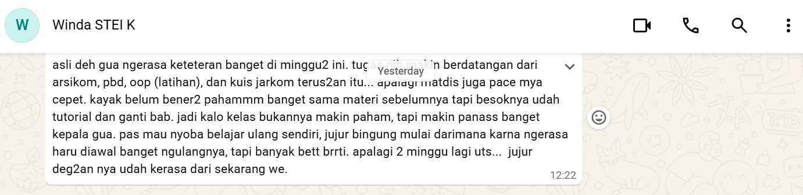
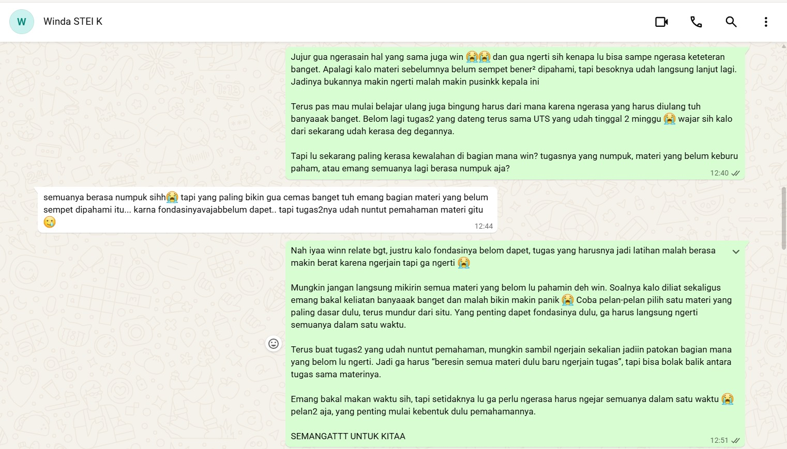
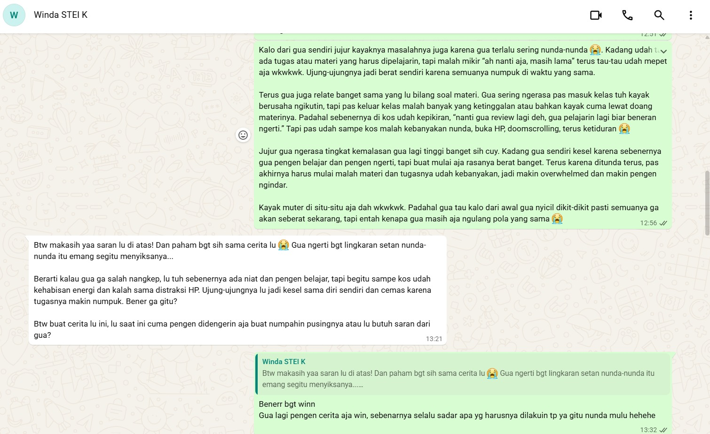

# Lembar Kerja Bab 03
## Relationship Conversation

**Nama Praktikan:** Grasella

**Mitra Latihan:** Winda

**Tanggal Pelaksanaan:** 27 September 2026

---

# Kompetensi Target

Latihan ini bertujuan untuk melatih kemampuan mendengarkan secara aktif dalam percakapan interpersonal.

Saya berlatih untuk tidak langsung memberikan solusi ketika seseorang bercerita, tetapi terlebih dahulu:

1. mendengarkan isi pembicaraan;
2. memahami makna di balik cerita;
3. mengenali kemungkinan emosi dan kebutuhan;
4. membedakan fakta dari interpretasi;
5. mengajukan pertanyaan untuk memperjelas;
6. menggunakan Pertanyaan Emas untuk mengetahui bentuk bantuan yang dibutuhkan;
7. menyesuaikan respons berdasarkan kebutuhan lawan bicara;
8. memvalidasi pengalaman tanpa mengambil alih keputusan lawan bicara.

Prinsip yang saya gunakan dalam latihan ini adalah:

> **Dengar → Pahami → Klarifikasi → Cek Kebutuhan → Adaptasi Respons.**

Saya juga belajar bahwa **mendengarkan dan memberikan saran tidak selalu bertentangan**. Saran dapat diberikan apabila memang merupakan bentuk bantuan yang diinginkan oleh lawan bicara.

---

# BAGIAN A — TIGA TINGKAT LISTENING

## 1. Tingkat 1 — Kata

Pada awal percakapan, Winda menceritakan mengenai kondisi perkuliahannya yang sedang terasa berat.

Ia membicarakan tugas dan materi kuliah yang menumpuk, sementara waktu untuk memahami materi juga terbatas karena terdapat berbagai tuntutan akademik seperti kuis dan UTS.

Dari cerita Winda, saya menangkap beberapa informasi utama:

- terdapat tugas dan materi kuliah yang perlu diselesaikan;
- terdapat materi yang belum dipahami dengan baik;
- tuntutan akademik datang dalam waktu yang berdekatan;
- terdapat kuis dan UTS;
- kondisi tersebut membuat Winda merasa kewalahan.

Pada tahap ini saya berusaha membatasi diri pada hal-hal yang benar-benar disampaikan.

Saya tidak langsung menyimpulkan bahwa:

- Winda tidak bisa mengatur waktu;
- Winda kurang belajar;
- Winda tidak mampu menghadapi tugas;
- atau Winda tidak bertanggung jawab.

Hal-hal tersebut merupakan interpretasi yang belum tentu benar.

### Evidence 1

Evidence ini menunjukkan konteks awal percakapan ketika Winda menceritakan keresahannya mengenai tugas, materi, dan kondisi akademiknya.

Evidence ini digunakan sebagai bukti bahwa saya berada pada posisi sebagai pendengar ketika Winda menceritakan situasinya.

---

# 2. Tingkat 2 — Makna

Setelah mendengarkan cerita Winda, saya menyadari bahwa masalahnya mungkin tidak sesederhana “tugasnya banyak”.

Karena itu, saya mengajukan pertanyaan:

> “Tapi lu sekarang paling kerasa kewalahan di bagian mana win? Tugasnya yang numpuk, materi yang belum keburu paham, atau emang semuanya lagi berasa numpuk aja?”

Pertanyaan tersebut saya gunakan untuk memperjelas makna dari cerita Winda.

Saya memberikan beberapa kemungkinan agar Winda dapat menjelaskan sendiri bagian mana yang paling terasa berat baginya.

Dari percakapan tersebut, saya memahami bahwa situasi yang dialami Winda berkaitan dengan beberapa tuntutan akademik yang datang bersamaan, termasuk tugas dan materi yang belum sempat dipahami dengan baik.

Karena itu, saya tidak menyederhanakan masalahnya menjadi:

> “Winda cuma punya terlalu banyak tugas.”

Saya memahaminya sebagai:

> **Winda sedang menghadapi beberapa tuntutan akademik secara bersamaan, sementara masih terdapat materi yang belum sempat dipahami dengan baik sehingga membuatnya merasa kewalahan.**

Namun, saya tetap membedakan antara informasi yang disampaikan Winda dan interpretasi saya terhadap makna cerita tersebut.

---

# 3. Tingkat 3 — Pribadi

Pada tingkat ketiga, saya mencoba memahami pengalaman Winda sebagai pribadi, bukan hanya memahami daftar tugas yang sedang dihadapinya.

Dari cara Winda menceritakan situasinya, saya menangkap kemungkinan adanya beberapa emosi seperti:

- cemas;
- kewalahan;
- frustrasi;
- tertekan.

Saya menggunakan kata **“kemungkinan”** karena saya menyadari bahwa saya tidak dapat mengetahui kondisi emosional orang lain secara pasti hanya berdasarkan pengamatan.

Dengan demikian, saya belajar bahwa:

> **Saya dapat menangkap kemungkinan emosi seseorang, tetapi orang tersebut tetap memiliki otoritas atas pengalaman emosinya sendiri.**

Saya juga memperkirakan bahwa Winda mungkin membutuhkan:

- seseorang yang mau mendengarkan;
- ruang untuk menjelaskan situasinya;
- bantuan untuk memikirkan situasi;
- atau saran mengenai apa yang dapat dilakukan.

Namun, saya tidak ingin menentukan sendiri kebutuhan Winda.

Hal inilah yang kemudian membuat saya menggunakan **Pertanyaan Emas**.

---

# BAGIAN B — PERTANYAAN EMAS

## 1. Mengecek Kebutuhan Sebelum Memberikan Pendapat

Sebelum memberikan pendapat, saya bertanya:

> “Win, sebelum gua kasih pendapat, gua mau ngerti dulu. Lu sekarang lebih butuh gua dengerin aja, bantu mikirin pilihan bareng, atau lu memang pengen gua kasih saran?”

Saya sengaja memberikan tiga kemungkinan bentuk bantuan:

1. didengarkan;
2. dibantu memikirkan pilihan;
3. diberikan saran.

Tujuan saya bukan sekadar menanyakan pertanyaan tersebut, tetapi memastikan bahwa saya tidak langsung mengasumsikan bentuk bantuan yang dibutuhkan Winda.

---

## 2. Jawaban Winda

Winda kemudian menyampaikan bahwa ia ingin **didengarkan sekaligus mendapatkan saran**.

Jawaban tersebut menjadi informasi penting bagi saya karena saya sekarang memiliki dasar untuk menentukan cara merespons.

Saya tidak perlu memilih antara:

> “hanya mendengarkan”

atau

> “langsung memberikan saran”.

Sebaliknya, saya memahami bahwa kebutuhan Winda pada saat itu adalah **mendapatkan ruang untuk didengarkan sekaligus memperoleh saran setelah ceritanya dipahami**.

---

## 3. Adaptasi Berdasarkan Jawaban Winda

Jawaban Winda kemudian saya gunakan untuk menyesuaikan respons.

Saya melakukan dua hal secara berurutan:

### Pertama — Mendengarkan

Saya tetap memberikan ruang bagi Winda untuk menjelaskan situasinya dan tidak langsung memotong cerita dengan solusi.

Saya berusaha memahami:

- apa yang sedang ia hadapi;
- bagian mana yang paling membuatnya kewalahan;
- bagaimana ia melihat situasinya sendiri.

### Kedua — Memberikan Saran

Setelah konteksnya cukup jelas, saya memberikan saran karena Winda memang menyampaikan bahwa ia ingin mendapatkan saran.

Dengan demikian, alur respons saya adalah:

> **Winda bercerita → saya mendengarkan → saya mengklarifikasi → saya mengecek kebutuhan → Winda meminta didengarkan sekaligus diberi saran → saya tetap mendengarkan → saya memberikan saran.**

Hal ini merupakan bagian paling penting dari latihan karena menunjukkan bahwa saya tidak hanya **menanyakan kebutuhan**, tetapi juga **menggunakan jawaban tersebut untuk menentukan respons**.

---

## Evidence 2 — Pertanyaan Emas

Screenshot ini menunjukkan bahwa saya secara eksplisit menanyakan kebutuhan Winda sebelum memberikan pendapat.

Screenshot tersebut tidak menampilkan keseluruhan jawaban Winda, sehingga saya tidak menggunakan gambar tersebut untuk mengklaim bahwa pilihan Winda terlihat di dalam screenshot.

Jawaban Winda mengenai kebutuhannya merupakan bagian dari catatan saya terhadap percakapan yang terjadi.

Hal yang penting adalah adanya hubungan antara:

> **pertanyaan saya → jawaban Winda → respons saya.**

---

# BAGIAN C — ADAPTASI RESPONS

## 1. Dari Pertanyaan Menjadi Tindakan

Pertanyaan Emas tidak saya gunakan sebagai formalitas.

Setelah mengetahui bahwa Winda ingin **didengarkan sekaligus mendapatkan saran**, saya menyesuaikan cara saya berkomunikasi.

Jika Winda hanya ingin didengarkan, saya tidak akan memaksakan solusi.

Jika Winda hanya ingin memikirkan pilihan bersama, saya akan lebih banyak membantu memetakan alternatif.

Namun, dalam percakapan ini Winda juga menginginkan saran.

Karena itu, setelah mendengarkan dan memahami konteksnya, saya memberikan saran yang relevan dengan masalah yang sedang ia ceritakan.

---

## 2. Rangkaian Adaptasi

| Tahap | Tindakan Saya | Tujuan |
|---|---|---|
| 1 | Mendengarkan cerita Winda | Memberikan ruang untuk berbicara |
| 2 | Mengajukan pertanyaan klarifikasi | Memahami masalah secara lebih spesifik |
| 3 | Menanyakan Pertanyaan Emas | Mengetahui bentuk bantuan yang diinginkan |
| 4 | Mendapatkan jawaban Winda | Mengetahui bahwa ia ingin didengarkan sekaligus diberi saran |
| 5 | Tetap mendengarkan | Memenuhi kebutuhan untuk didengarkan |
| 6 | Memberikan saran | Memenuhi kebutuhan untuk mendapatkan saran |
| 7 | Mengevaluasi respons | Menilai apakah respons saya sesuai dengan konteks |

Dari tabel tersebut terlihat bahwa jawaban Winda benar-benar memengaruhi respons saya.

---

# 3. Evidence 3 — Respons dan Saran

Evidence ini menunjukkan tahap ketika saya memberikan respons dan saran setelah proses mendengarkan dan memahami konteks.

Hubungan antara evidence ini dan Pertanyaan Emas adalah:

> **Pertanyaan Emas → Winda meminta didengarkan sekaligus diberi saran → saya mendengarkan → saya memberikan saran.**

Dengan demikian, saran yang saya berikan bukan respons spontan sejak awal percakapan.

Saran tersebut diberikan setelah saya mengetahui bahwa saran memang termasuk bentuk bantuan yang diinginkan Winda.

---

# BAGIAN D — FEEDBACK DAN RESPONS LAWAN BICARA

## 1. Respons Winda terhadap Saran

Setelah saya memberikan respons dan saran, Winda memberikan tanggapan:

> “Btw makasih yaa saran lu di atas!”

Saya menggunakan tanggapan tersebut sebagai indikator bahwa saran yang saya berikan diterima secara positif oleh Winda.

Namun, saya tidak menyimpulkan bahwa seluruh masalah Winda otomatis selesai hanya karena ia berterima kasih.

Hal yang dapat saya simpulkan dari respons tersebut adalah:

> **Winda menerima dan mengapresiasi saran yang saya berikan.**

Hal tersebut konsisten dengan kebutuhan yang sebelumnya ia sampaikan, yaitu ingin didengarkan sekaligus mendapatkan saran.

---

# 2. Hubungan antara Kebutuhan dan Respons

Dari keseluruhan percakapan, saya melihat hubungan sebagai berikut:

> **Kebutuhan Winda:** ingin didengarkan + mendapatkan saran.

> **Respons saya:** memberikan ruang untuk bercerita + memberikan saran setelah memahami konteks.

> **Respons Winda:** mengapresiasi saran yang diberikan.

Dengan demikian, saya tidak hanya berfokus pada “apa yang ingin saya katakan”, tetapi juga mempertimbangkan:

> **“Apa yang sebenarnya dibutuhkan oleh orang yang sedang berbicara dengan saya?”**

---

# BAGIAN E — TIGA TINGKAT LISTENING DALAM PRAKTIK

## Tingkat 1 — Kata

Saya memperhatikan informasi literal mengenai:

- tugas;
- materi;
- kuis;
- UTS;
- dan kesulitan akademik yang diceritakan.

Saya berusaha tidak menambahkan asumsi yang tidak disampaikan.

---

## Tingkat 2 — Makna

Saya mencoba memahami apa yang sebenarnya membuat Winda merasa kewalahan.

Saya menggunakan pertanyaan:

> “Tapi lu sekarang paling kerasa kewalahan di bagian mana win?”

Pertanyaan tersebut membantu saya memahami bahwa masalahnya bukan sekadar jumlah tugas, tetapi juga adanya materi yang belum sempat dipahami dengan baik.

---

## Tingkat 3 — Pribadi

Saya mencoba memahami pengalaman Winda sebagai pribadi.

Saya memperhatikan kemungkinan emosi seperti cemas dan kewalahan, tetapi tidak menganggap interpretasi saya sebagai fakta mutlak.

Saya juga memberikan ruang kepada Winda untuk menentukan sendiri bentuk bantuan yang ia butuhkan.

---

# BAGIAN F — FEEDBACK DARI LAWAN BICARA

Dalam latihan ini, saya juga memperhatikan respons Winda terhadap cara saya memberikan saran.

Winda mengatakan:

> “Btw makasih yaa saran lu di atas!”

Bagi saya, respons tersebut menunjukkan bahwa saran yang diberikan dapat diterima dengan baik.

Namun, saya menyadari bahwa feedback tersebut berbeda dengan pertanyaan evaluasi yang lebih formal seperti:

> “Di bagian mana kamu paling merasa didengarkan?”

atau:

> “Di bagian mana saya terlihat membuat asumsi?”

Karena itu, saya tidak mengklaim bahwa kalimat “makasih yaa” merupakan jawaban lengkap terhadap seluruh pertanyaan evaluasi.

Saya menggunakannya secara spesifik sebagai **feedback terhadap saran yang saya berikan**.

---

# BAGIAN G — KEBIASAAN OTOMATIS: FIXING

Latihan ini membuat saya menyadari bahwa saya memiliki kecenderungan untuk cepat masuk ke mode *fixing*.

Ketika seseorang bercerita, saya sering langsung berpikir:

> “Masalahnya apa?”

kemudian:

> “Solusinya apa?”

Kecenderungan tersebut dapat berguna ketika seseorang memang meminta solusi.

Namun, jika saya melakukannya terlalu cepat, saya dapat melewatkan kebutuhan orang tersebut untuk terlebih dahulu didengarkan.

Dalam percakapan dengan Winda, saya mencoba menghentikan kebiasaan tersebut melalui Pertanyaan Emas.

Perbedaannya adalah:

### Pola otomatis

> Teman cerita → saya mencari masalah → saya memberikan solusi.

### Pola yang saya latih

> Teman cerita → saya mendengarkan → saya mengklarifikasi → saya mengecek kebutuhan → saya menyesuaikan respons.

Saya menyadari bahwa perubahan tersebut membuat saya tidak lagi menjadikan “memberikan solusi” sebagai satu-satunya ukuran keberhasilan dalam membantu seseorang.

---

# BAGIAN H — MEMAHAMI VS MENYETUJUI

Saya juga belajar bahwa:

> **Memahami seseorang tidak sama dengan menyetujui seluruh pemikiran atau tindakannya.**

Dalam percakapan dengan Winda, saya dapat memahami bahwa kondisi akademik yang padat dapat membuat seseorang merasa kewalahan.

Memahami hal tersebut tidak berarti saya harus menganggap seluruh keputusan yang dibuat Winda pasti benar.

Saya dapat mengatakan:

> “Gua ngerti kenapa situasinya bikin lu kewalahan.”

tanpa harus mengatakan:

> “Semua keputusan yang lu ambil pasti benar.”

Bagi saya, kemampuan tersebut penting karena saya dapat tetap menjadi pendengar yang empatik tanpa kehilangan kemampuan untuk berpikir kritis.

---

# BAGIAN I — OTONOMI LAWAN BICARA

Salah satu pembelajaran utama saya adalah pentingnya menjaga otonomi lawan bicara.

Ketika Winda bercerita, saya memiliki beberapa pilihan:

- langsung menentukan solusi;
- menganggap saya lebih tahu apa yang harus dilakukan;
- atau memberikan ruang kepada Winda untuk menentukan bentuk bantuan yang ia butuhkan.

Saya memilih pilihan terakhir.

Pertanyaan:

> “Lu sekarang lebih butuh gua dengerin aja, bantu mikirin pilihan bareng, atau lu memang pengen gua kasih saran?”

memberikan Winda kendali terhadap bentuk interaksi.

Ketika Winda menjawab bahwa ia ingin didengarkan sekaligus mendapatkan saran, saya mengikuti kebutuhan tersebut.

Jadi, saya tidak mengambil alih keputusan Winda.

Saya berusaha menjadi orang yang membantu Winda berpikir dan mendapatkan perspektif tambahan.

---

# BAGIAN J — REACTION → RESPONSE

| Situasi | Reaction / Kebiasaan Otomatis | Response yang Saya Latih |
|---|---|---|
| Teman mulai bercerita | Langsung mencari solusi | Mendengarkan terlebih dahulu |
| Teman terlihat kewalahan | Langsung menebak penyebab | Bertanya untuk memperjelas |
| Teman menjelaskan masalah | Langsung memberikan saran | Memahami konteks terlebih dahulu |
| Tidak mengetahui bentuk bantuan yang dibutuhkan | Memilih bentuk bantuan menurut asumsi sendiri | Menggunakan Pertanyaan Emas |
| Teman ingin didengarkan | Tetap ingin memberikan solusi | Memberikan ruang untuk bercerita |
| Teman juga meminta saran | Takut memberikan solusi terlalu cepat | Memberikan saran setelah konteks dipahami |
| Teman memberikan respons | Menganggap masalah sudah selesai | Mengevaluasi apakah respons memang sesuai kebutuhan |

### Perubahan yang Saya Sadari

Sebelumnya saya cenderung menganggap:

> **“Kalau saya punya solusi, berarti saya harus langsung memberikannya.”**

Sekarang saya belajar:

> **“Memiliki solusi tidak otomatis berarti saatnya memberikan solusi.”**

Saya perlu mengetahui terlebih dahulu apakah lawan bicara memang menginginkan saran.

Dalam kasus Winda, jawabannya adalah iya: ia ingin didengarkan sekaligus mendapatkan saran.

Karena itu, saya dapat memberikan saran tanpa mengabaikan kebutuhan Winda untuk didengarkan.

---

# BAGIAN K — EVIDENCE

## Evidence 1 — Winda Menceritakan Keresahan

Evidence pertama menunjukkan Winda sedang menceritakan kondisi akademiknya.

Bukti ini mendukung tahap:

> **Listening — Tingkat 1: Kata.**

Saya menggunakan evidence ini untuk menunjukkan konteks awal percakapan dan posisi saya sebagai pendengar.

---

## Evidence 2 — Pertanyaan Emas

Saya bertanya:

> “Win, sebelum gua kasih pendapat, gua mau ngerti dulu. Lu sekarang lebih butuh gua dengerin aja, bantu mikirin pilihan bareng, atau lu memang pengen gua kasih saran?”

Pertanyaan ini menunjukkan bahwa saya secara sadar mengecek kebutuhan Winda sebelum menentukan respons.

Winda kemudian menyampaikan bahwa ia ingin:

> **didengarkan sekaligus mendapatkan saran.**

Informasi tersebut menjadi dasar saya untuk menyesuaikan respons.

---

## Evidence 3 — Respons dan Saran

Evidence ini menunjukkan tahap ketika saya memberikan respons dan saran.

Hubungannya dengan Pertanyaan Emas adalah:

> **Winda menyampaikan kebutuhan → saya menyesuaikan respons → saya memberikan saran setelah mendengarkan.**

Jadi evidence ini bukan berdiri sendiri.

Evidence ini merupakan kelanjutan dari proses listening dan klarifikasi sebelumnya.

---

## Evidence 4 — Pertukaran Peran

Setelah Winda menjadi pembicara, peran kemudian bertukar dan saya juga menjadi pembicara.

Winda memberikan respons terhadap cerita saya dan percakapan menjadi dua arah.

Dalam percakapan tersebut Winda mengatakan:

> “Btw makasih yaa saran lu di atas!”

Evidence ini menunjukkan bahwa komunikasi tidak hanya berjalan satu arah.

Saya dapat mengalami kedua sisi komunikasi:

- menjadi orang yang membutuhkan didengarkan;
- menjadi orang yang mendengarkan.

Pengalaman tersebut membantu saya memahami bahwa kebutuhan pendengar dan pembicara dapat berbeda.

---

# BAGIAN L — HUBUNGAN ANTAR-EVIDENCE

Keempat evidence dapat dibaca sebagai satu rangkaian proses komunikasi:

| Evidence | Fungsi dalam Latihan |
|---|---|
| **Bukti 1** | Winda membuka cerita dan saya berada pada posisi mendengarkan |
| **Bukti 2** | Saya melakukan klarifikasi kebutuhan melalui Pertanyaan Emas |
| **Bukti 3** | Saya menyesuaikan respons dan memberikan saran |
| **Bukti 4** | Terjadi pertukaran peran dan terdapat respons dari lawan bicara |

Rangkaian tersebut menunjukkan perubahan dari:

> **mendengar → langsung memberi solusi**

menjadi:

> **mendengar → memahami → mengecek kebutuhan → menyesuaikan respons.**

---

# BAGIAN M — KOMITMEN 14 HARI

Selama 14 hari setelah latihan ini, saya berkomitmen untuk melatih kebiasaan:

> **“Jangan memberikan solusi sebelum memastikan bentuk bantuan yang dibutuhkan.”**

Saya menargetkan minimal **3 percakapan**.

Pada setiap percakapan saya akan berusaha:

1. mendengarkan tanpa memotong;
2. mengajukan minimal satu pertanyaan terbuka;
3. melakukan parafrasa;
4. menyebutkan emosi sebagai dugaan, bukan fakta;
5. menggunakan Pertanyaan Emas ketika kebutuhan bantuan belum jelas;
6. menyesuaikan respons dengan kebutuhan lawan bicara;
7. memberikan saran hanya ketika memang relevan atau diminta.

### Indikator keberhasilan

Saya tidak akan mengukur keberhasilan hanya dari apakah saya berhasil memberikan solusi terbaik.

Saya akan mengukur keberhasilan dari:

> **Apakah saya mengetahui kebutuhan lawan bicara sebelum memilih bentuk respons?**

dan:

> **Apakah respons saya sesuai dengan kebutuhan yang telah disampaikan?**

---

# BAGIAN N — RELATIONSHIP STATE

## Sebelum Percakapan

Sebelum percakapan, saya dan Winda sudah memiliki hubungan pertemanan yang cukup terbuka.

Winda merasa cukup nyaman untuk menceritakan kesulitan akademiknya.

Namun, saya menyadari bahwa saya memiliki kecenderungan mengambil posisi sebagai pemberi solusi.

---

## Selama Percakapan

Selama percakapan, saya mencoba mengubah pola tersebut.

Saya:

1. mendengarkan cerita Winda;
2. mengklarifikasi bagian yang paling membuatnya kewalahan;
3. memperhatikan kemungkinan emosinya;
4. menanyakan bentuk bantuan yang ia butuhkan;
5. mengetahui bahwa ia ingin didengarkan sekaligus diberi saran;
6. memberikan ruang untuk bercerita;
7. memberikan saran setelah konteks dipahami.

---

## Setelah Percakapan

Setelah saya memberikan saran, Winda mengatakan:

> “Btw makasih yaa saran lu di atas!”

Saya melihat respons tersebut sebagai indikasi bahwa saran saya diterima secara positif.

Namun, pembelajaran terbesar saya bukan sekadar bahwa saran saya diterima.

Pembelajaran yang lebih penting adalah:

> **Saya perlu memahami kebutuhan lawan bicara terlebih dahulu sebelum menentukan bagaimana saya akan membantu.**

---

# BAGIAN O — PENGGUNAAN AI

Saya menggunakan AI sebagai alat bantu untuk:

1. menyusun struktur refleksi;
2. memastikan seluruh komponen latihan tercakup;
3. memperjelas perbedaan antara fakta, interpretasi, emosi, dan kebutuhan;
4. membantu mengevaluasi apakah alur *reaction → response* sudah terlihat;
5. memeriksa hubungan antara evidence dan kompetensi yang dilatih.

Pengalaman percakapan, konteks hubungan dengan Winda, isi percakapan, jawaban Winda terhadap Pertanyaan Emas, refleksi pribadi, dan evidence berasal dari pengalaman saya sendiri.

AI tidak digunakan untuk membuat percakapan atau evidence yang tidak terjadi.

---

# BAGIAN P — REFLEKSI AKHIR

Latihan ini membuat saya memahami bahwa mendengarkan secara aktif bukan hanya berarti diam ketika orang lain berbicara.

Listening memiliki beberapa lapisan:

> **mendengar kata → memahami makna → memahami pengalaman pribadi → mengecek kebutuhan → menyesuaikan respons.**

Dalam percakapan dengan Winda, saya awalnya mendengarkan ceritanya mengenai kesulitan akademik. Saya kemudian mengajukan pertanyaan untuk memperjelas bagian mana yang paling membuatnya kewalahan.

Saya menyadari bahwa saya memiliki kecenderungan untuk cepat masuk ke mode *problem-solving*. Karena itu, saya menggunakan Pertanyaan Emas:

> “Lu sekarang lebih butuh gua dengerin aja, bantu mikirin pilihan bareng, atau lu memang pengen gua kasih saran?”

Winda menyampaikan bahwa ia ingin didengarkan sekaligus mendapatkan saran.

Jawaban tersebut mengubah cara saya merespons. Saya tidak langsung memberikan solusi, tetapi tetap memberikan ruang bagi Winda untuk bercerita dan memahami konteksnya terlebih dahulu. Setelah itu, saya memberikan saran karena saran memang merupakan bentuk bantuan yang ia inginkan.

Dari latihan ini saya memahami bahwa:

> **memiliki solusi tidak berarti saya harus langsung memberikan solusi.**

Saya perlu memastikan terlebih dahulu apakah solusi tersebut memang merupakan bentuk bantuan yang dibutuhkan.

Saya juga belajar bahwa memahami seseorang tidak berarti harus menyetujui seluruh pemikirannya.

Sebagai pendengar, saya ingin dapat memberikan empati sekaligus tetap menghargai otonomi lawan bicara.

Pembelajaran utama saya adalah:

> **Listen first, understand the need, then adapt the response.**

---

# SELF-ASSESSMENT

| Dimensi Penilaian | Skor |
|---|---:|
| Kehadiran & Menyimak Aktif | 4/4 |
| Pemisahan Fakta & Interpretasi | 4/4 |
| Pendalaman Rasa Ingin Tahu (Pertanyaan) | 4/4 |
| Validasi Emosi & Otonomi | 4/4 |
| **Total** | **16/16** |

## 1. Kehadiran & Menyimak Aktif — 4/4

Saya memberikan ruang kepada Winda untuk menceritakan kondisinya sebelum memberikan saran.

Saya menggunakan pertanyaan klarifikasi untuk memahami bagian yang paling membuatnya kewalahan dan tidak langsung memotong cerita dengan solusi.

Saya juga menyadari bahwa mendengarkan bukan sekadar menunggu giliran berbicara, tetapi berusaha memahami pengalaman orang lain.

---

## 2. Pemisahan Fakta & Interpretasi — 4/4

Saya membedakan informasi yang benar-benar disampaikan Winda dari interpretasi saya mengenai emosi dan kebutuhannya.

Saya menggunakan bahasa seperti “kemungkinan” ketika menyimpulkan emosi dan tidak menjadikan interpretasi saya sebagai fakta.

Saya juga tidak menyimpulkan bahwa Winda tidak mampu mengatur waktu atau tidak bertanggung jawab hanya berdasarkan cerita mengenai kesulitan akademiknya.

---

## 3. Pendalaman Rasa Ingin Tahu (Pertanyaan) — 4/4

Saya menggunakan pertanyaan terbuka untuk memperjelas bagian yang paling membuat Winda kewalahan.

Saya juga menggunakan Pertanyaan Emas untuk mengetahui bentuk bantuan yang ia butuhkan:

> “Lu sekarang lebih butuh gua dengerin aja, bantu mikirin pilihan bareng, atau lu memang pengen gua kasih saran?”

Winda menyampaikan bahwa ia ingin **didengarkan sekaligus mendapatkan saran**.

Saya kemudian menggunakan jawaban tersebut untuk menyesuaikan respons saya: saya tetap mendengarkan terlebih dahulu, kemudian memberikan saran karena saran memang merupakan bentuk bantuan yang ia inginkan.

Dengan demikian, saya tidak hanya mengajukan pertanyaan, tetapi **menggunakan jawaban lawan bicara untuk mengadaptasi respons saya**.

---

## 4. Validasi Emosi & Otonomi — 4/4

Saya mengakui kemungkinan emosi Winda tanpa mengklaim bahwa saya mengetahui perasaannya secara pasti.

Saya juga memberikan otonomi kepada Winda untuk menentukan bentuk bantuan yang ia butuhkan.

Ketika Winda menyampaikan bahwa ia ingin didengarkan sekaligus mendapatkan saran, saya mengikuti kebutuhan tersebut tanpa memaksakan bentuk bantuan lain.

Saya memahami bahwa membantu seseorang tidak berarti mengambil alih keputusan orang tersebut.

---

# TOTAL SELF-ASSESSMENT

\[
4 + 4 + 4 + 4 = 16
\]

\[
\frac{16}{16} \times 100 = 100
\]

**Self-Assessment: 16/16**

**Nilai Konversi: 100/100**

---

# KESIMPULAN

Latihan ini mengubah cara saya memandang listening.

Sebelumnya, saya cenderung berpikir:

> **“Kalau seseorang bercerita, saya harus membantu dengan memberikan solusi.”**

Sekarang saya memahami bahwa proses yang lebih baik adalah:

> **“Dengarkan dulu → pahami → klarifikasi → cek kebutuhan → adaptasi.”**

Dalam percakapan dengan Winda, saya mengetahui bahwa ia ingin **didengarkan sekaligus mendapatkan saran**. Karena itu, saya menyesuaikan respons saya dengan memberikan ruang untuk bercerita terlebih dahulu dan kemudian memberikan saran.

Saya belajar bahwa kualitas komunikasi interpersonal tidak hanya ditentukan oleh **apa yang saya katakan**, tetapi juga oleh **seberapa sesuai respons saya dengan kebutuhan orang yang sedang berbicara dengan saya**.

Komitmen saya setelah latihan ini adalah mempertahankan kebiasaan menggunakan Pertanyaan Emas ketika saya belum yakin mengenai kebutuhan lawan bicara.

> **Saya tidak harus selalu menjadi orang yang paling cepat menemukan solusi. Saya perlu menjadi orang yang terlebih dahulu memahami apa yang sebenarnya dibutuhkan.**